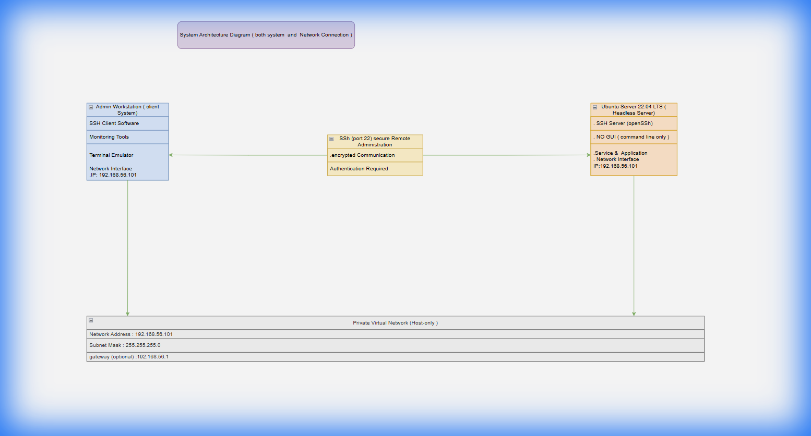

# Journal - Operating System

This repository contains the weekly journal reports for the Operating System course.

## Student Information
- **Name:** Ramesh Bist
- **Student ID:** A00030110
- **Project:** Operating System Journal

## Contents
The repository includes weekly reports in PDF format covering the following topics:

- **Week 1:** Introduction to Operating Systems
- **Week 2:** Process Management
- **Week 3:** Memory Management
- **Week 4:** File Systems
- **Week 5:** Input/Output Systems
- **Week 6:** Security and Protection
- **Week 7:** Case Studies

## File Structure
- `week1.pdf`
- `week2.pdf`
- `week3.pdf`
- `week4.pdf`
- `week5.pdf`
- `week6.pdf`
- `week7.pdf`
- `architecture_diagram.png` - System architecture diagram.
- `screenshots/` - Directory containing relevant command screenshots.
- `System Architec cture and network system.drawio` - Original diagram source (XML).

## System Architecture

